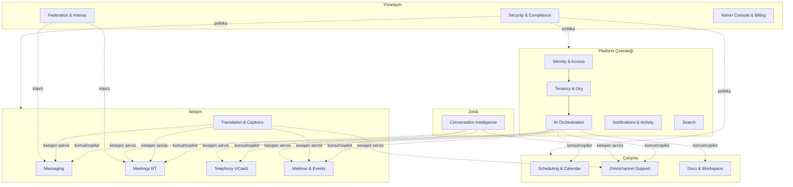
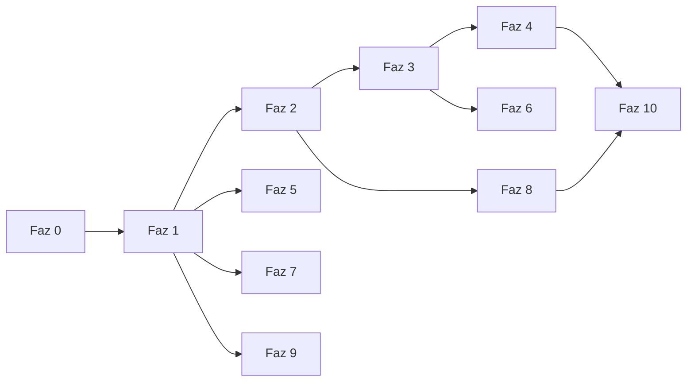

# AURA — AI-First Birleşik İletişim & İşbirliği Platformu
## Faz Faz Geliştirme Planı (Frontend, FastAPI-uyumlu)

> **Kod adı:** `AURA` (yer tutucu — markayla değiştirilebilir).
> **Kapsam:** Yalnızca frontend. Tıklayınca çalışan (mock data) bir SaaS panel. Backend orkestrasyonu **FastAPI** merkezdedir; bu plan FastAPI'nin uygulayacağı sözleşmeleri (OpenAPI/şema) tanımlar ama backend kodu yazmaz.
> **Paradigma:** AI-orkestrasyon merkezli (komut paleti + her domain'e gömülü copilot/ajan).
> **Yöntem:** Her faz **önce test → sonra şema/sözleşme → sonra geliştirme** sırasıyla ilerler. Mimari **DDD** (bounded context) temellidir.
> **Standartlar:** WCAG 2.2 **AAA**, min metin **1rem**, i18n (birincil **EN**, ikincil **TR**), multitenancy.

---

## 0. Yönetici Özeti

Rakip analizindeki 18+ üründen sentezlenen tek bir AI-first platform. Sekiz özellik ekseni (mesajlaşma, video, sesli/PSTN, AI asistan, AI analiz, takvim, webinar, gerçek zamanlı çeviri) + açık kaynak/E2EE/federasyon boyutları, **11 faza** (Faz 0 hazırlık + Faz 1–10 domain) bölünmüştür.

**Bu turun teslimi:**
1. Bu plan dokümanı (faz faz, DDD, test-first, sözleşme-first).
2. `web/` altında **Faz 1 clickable iskele**: AI-orkestrasyon shell (komut paleti + copilot paneli + tenant/workspace switcher + auth mock) ve domain rotalarının placeholder'ları — mock data ile gezilebilir.

**Neden bu sıra:** Çekirdek omurga (kimlik, tenant, AI orkestrasyon) olmadan hiçbir domain çoğaltılamaz; iletişim domain'leri (mesajlaşma → toplantı → çeviri/analiz) bağımlılık zincirini izler; ağır/bağımsız domain'ler (PSTN, webinar, omnichannel, doküman) sonra; egemenlik/güvenlik/admin en sona, çünkü tüm context'lerin üzerine kesişen bir katman olarak oturur.

---

## 1. Ürün Sentezi ve Konumlandırma

### 1.1 Wedge (ayırt edici çekirdek)
Matristeki ayırt edici özellikler üç stratejik temada toplanır; AURA üçünü **tek panelde** birleştirir — pazardaki boşluk budur:

| Tema | Kaynak ürünler | AURA'nın iddiası |
|---|---|---|
| **AI her yerde, ücretsiz dahil** | Zoom AI Companion, Dialpad konuşma zekâsı, Copilot | AI asistan + konuşma istihbaratı add-on değil; orkestrasyon omurgası. |
| **Gerçek zamanlı çeviri / küresel** | Google Meet (70+ dil, sesi koruyan), melp | Mesaj + altyazı + konuşmadan-konuşmaya çeviri tüm domain'lerde kesişen servis. |
| **Egemenlik + açık + omnichannel** | Element/Matrix (E2EE, federasyon), Chatwoot (omnichannel), Mattermost (self-host) | Self-host edilebilir, E2EE opsiyonlu, omnichannel müşteri desteği gömülü. |

**Konumlandırma cümlesi:** "Teams/Slack'in birleşikliği + Zoom'un ölçeği + Google Meet'in çevirisi + Element'in egemenliği + Chatwoot'un omnichannel'ı — hepsi AI-orkestrasyon merkezli tek panelde."

### 1.2 Yap / Entegre Et / Erteleme kararı (domain bazında)

| Domain | Karar | Gerekçe |
|---|---|---|
| Mesajlaşma (kanal/DM/thread + topic-threading) | **Yap** | Çekirdek; Zulip topic modeli benimsenir. |
| Video/sesli toplantı | **Entegre (LiveKit/Jitsi) + kendi UI** | Medya altyapısı arkaplan servisi; UX bize ait. |
| Telefon/PSTN (UCaaS) | **UI yap, taşıyıcı entegre** | Dialer/akış UI bizim; PSTN taşıyıcısı sözleşmeli. |
| Webinar (100k) | **Yap (UI) + yayın altyapısı entegre** | Simulive/registration/Q&A UX bize ait. |
| AI asistan + analiz | **Yap (orkestrasyon)** | Wedge; backend LLM/ASR servislerine sözleşmeyle bağlı. |
| Gerçek zamanlı çeviri | **Yap (kesişen servis)** | Wedge; ASR/MT servis sözleşmesi. |
| Takvim & zamanlama | **Sıfırdan yap** | Cal.com/Calendly özelliklerini kendimiz geliştiriyoruz (talep). |
| Omnichannel destek | **Entegre (Chatwoot) + kendi UI** | Arkaplan servisi Chatwoot; panel bizim. |
| Doküman/proje (doc-as-app) | **Yap** | Coda/Basecamp ayırt ediciliği. |
| E2EE / Federasyon | **Yap (opsiyon) + Matrix köprüsü** | Egemenlik teması; faz 10. |

---

## 2. Mimari İlkeler

1. **Frontend-only, sözleşme-first.** UI, FastAPI'nin uygulayacağı **OpenAPI** sözleşmesine karşı geliştirilir. Tipler `openapi-typescript` ile üretilir. Çalışma zamanında **mock API katmanı** bu sözleşmeyi birebir taklit eder; gerçek backend gelince yalnızca taşıma katmanı değişir (ekran/iş mantığı sabit kalır).
2. **AI-orkestrasyon merkezli.** Her domain bir **komut kümesi** (command registry) ve **copilot bağlamı** yayınlar. Kullanıcı "konuşmadan eyleme" geçer; klasik sol-nav ikincildir.
3. **DDD / bounded context.** Frontend, backend bounded context'lerini yansıtan **feature modülleri**ne bölünür. Her modülün kendi anti-corruption layer'ı (API ↔ domain modeli dönüşümü) vardır.
4. **Multitenancy.** Tenant bağlamı kök seviyede; tüm sorgu anahtarları, tema, yetki ve i18n tenant'a göre kapsamlanır.
5. **Erişilebilirlik = mimari kısıt.** WCAG 2.2 AAA, min 1rem metin, ≥7:1 kontrast, ≥44px hedef boyutu, odak yönetimi, reduced-motion. Token ve lint ile zorunlu.
6. **i18n by default.** Hardcoded string yasak. ICU/çoğul, namespace per-domain, RTL-hazır.
7. **Next.js yok.** SPA: **Vite + React 19 + react-router**. Gerekçe: server/client component belirsizliği ve framework oynaklığı yerine net, deterministik istemci sınırı; FastAPI ile temiz BFF/sözleşme ayrımı.

---

## 3. Teknoloji Yığını ve Gerekçeler

| Katman | Seçim | Gerekçe |
|---|---|---|
| Dil | TypeScript (strict) | Tip güvenliği, sözleşme türetimi. |
| Çatı | React 19 + Vite | SPA, hızlı HMR, deterministik istemci. |
| Yönlendirme | react-router (data router) | Loader/action ile sözleşme-uyumlu veri akışı. |
| Stil | Tailwind CSS v4 (CSS-first `@theme`) + SCSS (gerekli yerde) | Token tabanlı, AAA palet kontrolü. |
| Bileşen | shadcn/ui (Radix primitives) + flowbite-react | Kod sahipliği + erişilebilir primitives. |
| Komut paleti | cmdk | AI-orkestrasyon girişi. |
| Server-state | TanStack Query v5 | Cache, retry, sözleşme anahtarları. |
| Client-state | Zustand | Tenant/auth/UI/komut kayıt defteri. |
| Gerçek zamanlı medya | LiveKit (WebRTC) + Jitsi | Toplantı/çeviri/sesli akış. |
| i18n | i18next + react-i18next | Namespace, ICU, pseudo-loc. |
| İkonlar | Phosphor (öncelik) + FontAwesome | Kullanıcı tercih kuralı; CDN/paket. |
| Mock | MSW (test) + in-memory mockApi (runtime) | Sözleşme taklidi, deterministik test. |
| Test | Vitest + Testing Library + Playwright + axe-core | Birim/bileşen/e2e/a11y. |
| Tip üretimi | openapi-typescript | FastAPI OpenAPI → TS tipleri. |

**Backend handoff notu (frontend dışı):** Şema kaynağı **Prisma schema** dili; FastAPI tarafında `prisma-client-py` ile tüketilir, **PostgreSQL** hedef. (Supabase kullanılmaz.) Bu plandaki şema bölümleri yalnızca **yapı** (entity/alan/ilişki/event) gösterir; veri doldurmaz.

---

## 4. DDD Bağlam Haritası (Bounded Contexts)

**Bağlam ilişki tipleri:** `AI Orchestration`, `Translation`, `Conversation Intelligence`, `Security` ve `Federation` **kesişen (shared kernel / open-host service)** context'lerdir; diğerleri **customer/supplier** ilişkisiyle bunları tüketir. Her tüketici context kendi **anti-corruption layer**'ını tutar.

---

## 5. Faz Genel Bakış

| Faz | Ad | Birincil Bounded Context'ler | Teslim ettiği ayırt edicilik |
|---|---|---|---|
| **0** | Temel & Tasarım Sistemi | (yok — platform UI altyapısı) | AAA token, i18n, shell, mock infra, test harness |
| **1** | Kimlik, Tenant & AI Omurga | IAM, Tenancy, AI Orchestration | Multitenancy + AI-orkestrasyon shell |
| **2** | Mesajlaşma | Messaging, Search (msg), Notifications | Kanal/DM/thread + Zulip topic-threading |
| **3** | Gerçek Zamanlı Toplantı | Meetings | Video/sesli + breakout/kayıt/lobby (LiveKit/Jitsi) |
| **4** | Çeviri & Konuşma Zekâsı | Translation, Conversation Intelligence | 70+ dil çeviri + duygu/koçluk/intent analizi |
| **5** | Telefon / UCaaS | Telephony | PSTN dialer + yönlendirme + SMS/MMS + analitik |
| **6** | Webinar & Canlı Etkinlik | Webinar & Events | 100k ölçek + simulive + registration + Q&A |
| **7** | Zamanlama & Takvim | Scheduling & Calendar | Cal.com/Calendly (sıfırdan) |
| **8** | Omnichannel Destek | Omnichannel Support | Chatwoot tabanlı birleşik inbox + Captain AI |
| **9** | Doküman & İşbirliği | Docs & Workspace | Doc-as-app + Kanban/Gantt/Hill |
| **10** | Egemenlik, Güvenlik & Admin | Federation, Security, Admin, Billing | E2EE/Matrix federasyon + audit + admin konsolu |

**Bağımlılık notu:** Faz 5/7/9 Faz 1'den sonra paralelleşebilir (bağımsız domain'ler). Faz 4 hem Faz 2 hem Faz 3'ü tükettiği için onlardan sonra gelir. Faz 10 tüm güvenlik/federasyon kesişimini en sona toplar.

---

## 6. Faz Detayları

> Her faz şablonu: **Amaç → DDD context → (1) Test stratejisi (önce) → (2) Şema/sözleşme (sonra) → (3) Frontend → DoD.** Şema bölümleri yalnızca yapı gösterir.

### Faz 0 — Temel & Tasarım Sistemi
**Amaç:** Tüm fazların üzerine oturduğu UI altyapısı. İş domain'i yok; "her şeyi mümkün kılan" katman.

**DDD context:** Yok (teknik temel). Çıktısı: shared kernel'in UI tarafı.

**(1) Test stratejisi (önce)**
- A11y temel testleri: axe-core ile sıfır ihlal; kontrast ≥7:1 birim testi (token doğrulama); odak-tuzağı testleri.
- i18n testi: hardcoded string lint kuralı; pseudo-localization snapshot'ı.
- Bileşen testleri: her primitive için Testing Library (rol/ad/klavye).
- Görsel regresyon: Playwright + snapshot (tema light/dark/high-contrast).

**(2) Şema/sözleşme (sonra)**
- Sözleşme yok; bunun yerine **design token sözleşmesi** (renk/uzay/tipografi/motion ölçekleri) ve **OpenAPI istemci üretim pipeline'ı** kurulur (boş contract'tan tip üretimi).

**(3) Frontend — yapı**
- **Bileşen hiyerarşisi:** `AppShell` → (`TopBar`, `PrimaryNav`, `CommandPalette`, `CopilotDock`, `Outlet`, `ToastViewport`).
- **Primitives:** `Button`, `Input`, `Dialog`, `DropdownMenu`, `Tabs`, `Tooltip`, `Avatar`, `Badge`, `Skeleton`, `Toast`, `VisuallyHidden`, `SkipLink`.
- **Props/state:** primitives kontrollü/kontrolsüz çift mod; `variant`/`size`/`tone` token-bağlı props.
- **Etkileşim kuralları:** Tüm interaktif öğeler klavyeyle erişilebilir; `Esc` diyalogları kapatır; odak geri yüklenir; `prefers-reduced-motion` animasyonu kapatır.
- **Stil token'ları:** `--font-size-base:1rem` (min), `--space-*`, `--radius-*`, `--color-fg/bg/accent` (AAA kontrast çiftleri), `--focus-ring`, `--motion-duration`.
- **Altyapı modülleri:** `i18n/` (en/tr namespace yükleyici), `mock/` (mockApi + MSW handlers), `lib/query` (TanStack client), `lib/store` (Zustand kök), `routes/` (data router).

**DoD:** Shell boş haliyle gezilebilir; tema değişir; en/tr geçişi çalışır; axe sıfır ihlal; CI'da test/lint/typecheck yeşil.

---

### Faz 1 — Kimlik, Tenant & AI Orkestrasyon Omurgası
**Amaç:** Multitenancy + AI-first shell'i canlandırmak. Kullanıcı giriş yapar, workspace seçer, komut paletiyle "konuşmadan eyleme" geçer. **(Bu turda iskelesi kuruldu.)**

**DDD context:** `IAM`, `Tenancy & Org`, `AI Orchestration`.
- **Ubiquitous language:** Identity, Principal, Role, Permission, Tenant, Workspace, Membership, Command, Action, Agent, CopilotSession, Grounding.
- **Aggregates:** `User`, `Tenant`(→`Workspace`→`Membership`), `Role`/`Permission`, `CommandRegistry`, `AgentRun`.
- **Domain events:** `UserSignedIn`, `WorkspaceSwitched`, `CommandInvoked`, `AgentRunStarted/Completed`, `PermissionDenied`.

**(1) Test stratejisi (önce)**
- Unit: RBAC karar fonksiyonu (`can(principal, action, resource)`), tenant kapsamlama (query key namespacing).
- Component: `LoginForm`, `WorkspaceSwitcher`, `CommandPalette`, `CopilotDock` (klavye/rol/ARIA).
- Contract (MSW): `/auth/session`, `/tenants`, `/workspaces`, `/commands`, `/agent/runs` sözleşme uyumu.
- E2E: giriş → workspace seç → komut paletiyle rota değiştir → copilot'a komut ver → mock aksiyon.
- A11y: komut paleti ARIA combobox deseni; odak yönetimi; AAA kontrast.

**(2) Şema/sözleşme (sonra) — yapı**
- `User { id, email, displayName, locale, avatarUrl, status }`
- `Tenant { id, slug, name, plan, region, branding }`
- `Workspace { id, tenantId, name, slug }`
- `Membership { id, userId, workspaceId, roleId, status }`
- `Role { id, tenantId, key, name }` · `Permission { id, key, resource, action }` · `RolePermission { roleId, permissionId }`
- `Command { key, titleI18nKey, scope, requires[], handlerRef }`
- `AgentRun { id, sessionId, input, status, steps[], output, createdAt }`
- **API:** `GET /auth/session`, `POST /auth/login` (mock), `GET /tenants`, `GET /workspaces?tenantId`, `GET /me/memberships`, `GET /commands?scope`, `POST /agent/runs`, `GET /agent/runs/:id` (SSE stream stub).
- **Events kanalı:** WS/SSE `agent.run.step`, `presence.update`.

**(3) Frontend — yapı**
- **Bileşen hiyerarşisi:** `AuthGate` → `AppShell` → (`TenantWorkspaceSwitcher`, `CommandPalette`, `CopilotDock`, `PrimaryNav`, domain `Outlet`).
- **Props/state:**
  - `authStore` (Zustand): `principal`, `status`, `login()`, `logout()`.
  - `tenantStore`: `activeTenant`, `activeWorkspace`, `switchWorkspace()`, türetilmiş `themeTokens`.
  - `commandStore`: `register(commands)`, `open`, `query`, `results`, `invoke(commandKey)`.
  - `copilotStore`: `session`, `messages`, `send(prompt, context)`, `streamingState`.
- **Etkileşim kuralları:** `Cmd/Ctrl+K` paleti açar; palet sonuçları rota + aksiyon + AI-önerisi karışık listeler; copilot dock her ekranda mevcut bağlamı (aktif domain + seçili nesne) otomatik "grounding" olarak alır; yetkisiz komutlar görünmez (RBAC süzgeci).
- **Stil token'ları:** tenant `branding` → CSS değişkenlerine map (accent/logo); palet `--surface-overlay`; copilot `--surface-raised`.
- **Query keys:** `['session']`, `['workspaces', tenantId]`, `['commands', scope]`, `['agentRun', id]`.
- **Mock data shape:** 1 demo tenant, 2 workspace, 1 kullanıcı, ~12 komut, copilot için sahte streaming.

**DoD:** Tenant/workspace değişimi tüm bağlamı kapsamlar; komut paleti + copilot mock aksiyon üretir; RBAC süzgeci çalışır; AAA + i18n yeşil.

---

### Faz 2 — Mesajlaşma
**Amaç:** Çekirdek iş iletişimi. Kanal + DM + thread; ek olarak **Zulip-tarzı topic-threading** (her tartışma ayrı topic).

**DDD context:** `Messaging` (+ tüketir: `Search`, `Notifications`, `Translation`).
- **Ubiquitous language:** Channel, Topic, Thread, DirectMessage, Message, Reaction, Mention, Attachment, ReadReceipt, Presence.
- **Aggregates:** `Channel`(→`Topic`→`Message`), `Conversation`(DM), `MessageDraft`.
- **Domain events:** `MessagePosted/Edited/Deleted`, `ReactionAdded`, `TopicMoved`, `MentionCreated`, `PresenceChanged`.

**(1) Test stratejisi (önce)**
- Unit: mesaj reducer (optimistic post/edit/delete), topic taşıma/bölme mantığı, mention parse.
- Component: `MessageComposer`, `MessageList`, `TopicSidebar`, `ReactionPicker`.
- Contract: `/channels`, `/topics`, `/messages` (cursor pagination), WS `message.posted`.
- E2E: kanal aç → topic seç → mesaj at (optimistic) → reaksiyon → thread aç → AI "özetle" komutu.
- A11y: mesaj listesi `log`/`feed` deseni; klavye gezintisi; ekran okuyucu duyuruları.

**(2) Şema/sözleşme (sonra) — yapı**
- `Channel { id, workspaceId, kind(public|private|broadcast), name, topicMode }`
- `Topic { id, channelId, title, status(open|resolved) }`
- `Message { id, channelId, topicId?, parentId?, authorId, body, richBlocks[], createdAt, editedAt }`
- `Reaction { messageId, userId, emoji }` · `Attachment { id, messageId, kind, url, meta }`
- `Mention { messageId, principalId, kind }` · `ReadReceipt { userId, channelId, lastReadMessageId }`
- **API:** `GET /channels`, `GET /channels/:id/topics`, `GET /messages?channelId&topicId&cursor`, `POST /messages`, `PATCH /messages/:id`, `POST /messages/:id/reactions`; WS `message.*`, `presence.*`.
- **AI kesişimi:** `POST /ai/summarize` (thread/kanal özeti), `POST /ai/translate` (mesaj çevirisi).

**(3) Frontend — yapı**
- **Bileşen hiyerarşisi:** `MessagingLayout` → (`ChannelNav`, `TopicSidebar`, `MessagePane`(`MessageList`+`MessageComposer`), `ThreadPanel`, `MessageContextActions`).
- **Props/state:** `messagingStore` (aktif kanal/topic, taslaklar, optimistic kuyruğu); Query infinite `['messages', channelId, topicId]`; `presenceStore`.
- **Etkileşim kuralları:** Composer `Enter` gönderir, `Shift+Enter` satır; `/` slash-komutları (AI dahil); mesaj üzerinde hover → bağlam aksiyonları (reaksiyon, thread, çevir, özetle); topic taşıma sürükle-bırak + klavye alternatifi.
- **Stil token'ları:** yoğunluk modu (`--density-comfortable|compact`), mention vurgu `--color-accent-subtle`.
- **Mock data:** ~3 kanal, ~2 topic/kanal, ~15 mesaj; sahte presence.

**DoD:** Optimistic mesajlaşma + topic-threading + AI özet/çeviri komutları mock ile çalışır; sonsuz kaydırma; AAA/i18n yeşil.

---

### Faz 3 — Gerçek Zamanlı Toplantı (Video/Sesli)
**Amaç:** LiveKit/Jitsi tabanlı toplantı UX'i; ekran paylaşımı, breakout, kayıt, lobby, sanal arka plan.

**DDD context:** `Meetings` (+ tüketir: `Translation`, `Conversation Intelligence`).
- **Ubiquitous language:** Meeting, Room, Participant, Track, ScreenShare, Breakout, Recording, Lobby, Layout.
- **Aggregates:** `Meeting`(→`Participant`→`Track`), `BreakoutSession`, `Recording`.
- **Domain events:** `MeetingStarted/Ended`, `ParticipantJoined/Left`, `TrackPublished`, `RecordingStarted`, `BreakoutOpened`.

**(1) Test stratejisi (önce)**
- Unit: katılımcı/track reducer; layout seçim algoritması (grid/speaker); lobby kabul mantığı.
- Component: `ControlBar`, `ParticipantTile`, `LobbyDialog`, `BreakoutManager` (medya **mock'lanır**, gerçek WebRTC test dışı).
- Contract: `/meetings`, `/meetings/:id/token` (LiveKit token stub), WS `participant.*`.
- E2E (mock medya): toplantı oluştur → lobby kabul → ekran paylaş (mock) → breakout aç → kayıt başlat → canlı altyazı paneli aç.
- A11y: kontroller klav­ye + ARIA; konuşmacı duyuruları; altyazı `aria-live`.

**(2) Şema/sözleşme (sonra) — yapı**
- `Meeting { id, workspaceId, title, scheduledStart, status, hostId, settings }`
- `Participant { id, meetingId, principalId, role(host|cohost|attendee), state }`
- `Track { id, participantId, kind(audio|video|screen), state }`
- `Breakout { id, meetingId, name, participantIds[] }` · `Recording { id, meetingId, status, url }`
- **API:** `POST /meetings`, `GET /meetings/:id`, `POST /meetings/:id/token`, `POST /meetings/:id/breakouts`, `POST /meetings/:id/recording`; WS `participant.*`, `track.*`.
- **Arkaplan servisi:** LiveKit (token + WebRTC), Jitsi (alternatif oda); altyazı/çeviri Faz 4 servisinden beslenir.

**(3) Frontend — yapı**
- **Bileşen hiyerarşisi:** `MeetingRoom` → (`Stage`(`ParticipantTile[]`/`ScreenShareView`), `ControlBar`, `SidePanel`(`ChatTab`,`ParticipantsTab`,`CaptionsTab`), `LobbyDialog`, `BreakoutManager`).
- **Props/state:** `meetingStore` (oda durumu, yerel medya bayrakları, aktif konuşmacı); LiveKit client adapter (anti-corruption layer); `captionsStore` (Faz 4).
- **Etkileşim kuralları:** kontrol çubuğu büyük hedefler (≥44px); push-to-talk; layout değiştir; reduced-motion'da geçiş animasyonsuz; altyazı dil seçici.
- **Stil token'ları:** sahne `--surface-stage`, aktif konuşmacı `--ring-active`.
- **Mock data:** sahte 4 katılımcı, sahte track durumları, mock altyazı akışı.

**DoD:** Toplantı UX'i mock medya ile tam gezilebilir; LiveKit adapter sözleşmesi hazır; breakout/lobby/kayıt akışları clickable; AAA/i18n yeşil.

---

### Faz 4 — Çeviri & Konuşma Zekâsı (AI Analiz)
**Amaç:** Wedge'in iki kesişen servisi: **gerçek zamanlı çeviri** (mesaj + altyazı + konuşmadan-konuşmaya) ve **konuşma istihbaratı** (duygu, canlı koçluk, scorecard, CSAT, intent, transkript).

**DDD context:** `Translation & Captions`, `Conversation Intelligence` (her ikisi **open-host service**).
- **Ubiquitous language:** Caption, TranslationStream, LanguagePair, Transcript, Sentiment, CoachingCue, Scorecard, Intent, Highlight.
- **Aggregates:** `TranslationSession`, `Transcript`(→`Segment`), `AnalysisReport`.
- **Domain events:** `CaptionEmitted`, `TranslationReady`, `SentimentShifted`, `CoachingCueRaised`, `HighlightDetected`.

**(1) Test stratejisi (önce)**
- Unit: segment birleştirme/zamanlama; dil çifti çözümleme; duygu eşik → cue mantığı.
- Component: `LiveCaptionPanel`, `TranscriptViewer`, `SentimentTimeline`, `ScorecardCard`, `CoachingToast`.
- Contract: SSE `caption.segment`, `translation.segment`, `intel.signal`; `/transcripts/:id`, `/analysis/:id`.
- E2E: toplantıda altyazı aç → dil değiştir → transkript görüntüle → analiz raporu aç.
- A11y: altyazı `aria-live=polite`, eşzamanlı çeviri için ayrı bölge; renk-bağımsız duygu göstergeleri.

**(2) Şema/sözleşme (sonra) — yapı**
- `Transcript { id, sourceType(meeting|call|webinar), sourceId, language, segments[] }`
- `Segment { id, transcriptId, speakerId, startMs, endMs, text, translations{lang:text} }`
- `AnalysisReport { id, sourceId, sentimentSeries[], intents[], scorecard{}, highlights[] }`
- **API:** `GET /transcripts/:id`, `GET /analysis/:id`; SSE `caption.*`, `translation.*`, `intel.*`.
- **Arkaplan servisi:** ASR + MT + LLM (FastAPI ardındaki AI servisleri); frontend yalnızca akış sözleşmesini tüketir.

**(3) Frontend — yapı**
- **Bileşen hiyerarşisi:** `CaptionsLayer` (toplantı içine enjekte), `TranscriptViewer`, `IntelligenceDashboard` → (`SentimentTimeline`, `IntentList`, `Scorecard`, `HighlightReel`).
- **Props/state:** `captionsStore` (aktif diller, segment tamponu), `intelStore` (canlı sinyaller, rapor).
- **Etkileşim kuralları:** çoklu hedef dil; "sesi koruyan" çeviri rozet göstergesi; canlı koçluk yalnızca yetkili rollere (whisper) — RBAC; transkriptten ara/atla.
- **Stil token'ları:** duygu skalası **renk + ikon + etiket** (renk-yalnız değil), `--intel-positive/neutral/negative`.
- **Mock data:** sahte segment akışı (en→tr), sahte duygu serisi, 1 örnek scorecard.

**DoD:** Çeviri + analiz kesişen servisleri Faz 2/3 yüzeylerine takılır; çoklu dil + AAA renk-bağımsızlık; i18n yeşil.

> **Uygulama notu — sertleştirme (kapanış):** Plandaki tüm sözleşme parçaları uygulandı. `TranslationSession` agregası ayrı `captionsStore` olarak kuruldu (aktif dil çiftleri + canlı altyazı tamponu + sesi-koruyan). Domain event'leri tipli `IntelEvent` birleşimine (`caption.emitted`/`translation.ready`/`intel.sentiment`/`intel.coaching`/`intel.highlight`) ve `EVENT_CHANNEL` ile `caption.*`/`translation.*`/`intel.*` SSE kanallarına bağlandı; `subscribeIntel` mock dispatcher tek `applyEvent` (idempotent) yoluna akar — `EventSource`'a geçişte tüketici değişmez. `GET /transcripts/:id` (`fetchTranscript`) ve `GET /analysis/:id` (`fetchAnalysis`) ayrı read-model sözleşmeleri. `Segment.translations` açık `{lang:text}` haritasıyla 70+ dil taşır (`segmentText` çözümler). Saf util'ler: `mergeSegments` (segment birleştirme/zamanlama), `resolveLangPair` (dil-çifti). Test: 65 (intelligence 21) — util + tipli stream (fake timers) + captionsStore + iki sözleşme + E2E zinciri (`e2e/intel.spec.ts`).

---

### Faz 5 — Telefon / UCaaS (PSTN)
**Amaç:** Dialpad-tarzı tam UCaaS UX'i: dialer, çağrı yönlendirme, görsel voicemail, SMS/MMS, auto-attendant, çağrı analitiği.

**DDD context:** `Telephony` (+ tüketir: `Conversation Intelligence`).
- **Ubiquitous language:** Call, Dialer, Line, Extension, RoutingRule, Voicemail, SMS, AutoAttendant, CallLog.
- **Aggregates:** `Call`, `PhoneLine`(→`RoutingRule`), `Voicemail`, `SmsThread`.
- **Domain events:** `CallPlaced/Answered/Ended`, `CallRouted`, `VoicemailLeft`, `SmsReceived`.

**(1) Test stratejisi (önce)**
- Unit: yönlendirme kuralı değerlendirme (find-me/follow-me), DTMF/numara normalizasyonu, presence→routing.
- Component: `Dialer`, `ActiveCallBar`, `VoicemailList`, `SmsThreadView`, `RoutingRuleBuilder`.
- Contract: `/calls`, `/voicemails`, `/sms`, `/lines`; WS `call.state`.
- E2E (mock taşıyıcı): numara çevir → çağrı durumu → tut/aktar → voicemail dinle → SMS yanıtla.
- A11y: dialer tuş takımı klavye + ekran okuyucu; aktif çağrı `aria-live` durum.

**(2) Şema/sözleşme (sonra) — yapı**
- `PhoneLine { id, workspaceId, e164, label, extensions[] }`
- `RoutingRule { id, lineId, condition, action(forward|voicemail|ivr) }`
- `Call { id, lineId, direction, from, to, state, startedAt, duration, recordingId? }`
- `Voicemail { id, lineId, from, durationMs, transcriptId? }` · `SmsMessage { id, threadId, from, to, body, media[] }`
- **API:** `GET /lines`, `POST /calls`, `PATCH /calls/:id` (hold/transfer), `GET /voicemails`, `GET/POST /sms`; WS `call.*`.
- **Arkaplan servisi:** PSTN taşıyıcı (SIP/VoIP) — frontend taşıyıcı-agnostik sözleşme tüketir.

**(3) Frontend — yapı**
- **Bileşen hiyerarşisi:** `PhoneLayout` → (`Dialer`, `CallHistory`, `VoicemailInbox`, `MessagesPane`, `RoutingRuleBuilder`, `ActiveCallBar`(global overlay)).
- **Props/state:** `callStore` (aktif çağrı, durum makinesi), `smsStore`, taşıyıcı adapter (ACL).
- **Etkileşim kuralları:** global `ActiveCallBar` her ekranda kalıcı; tuş takımı ≥44px; çağrı sırasında AI canlı transkript/koçluk (Faz 4); SMS'te şablon/otomasyon.
- **Stil token'ları:** çağrı durumu renk+ikon+etiket; `--call-active/hold/ringing`.
- **Mock data:** sahte çağrı geçmişi, 2 voicemail, 1 SMS thread, 1 hat + kurallar.

**DoD:** UCaaS UX clickable; durum makinesi sağlam; taşıyıcı adapter sözleşmesi hazır; AAA/i18n yeşil.

> **Uygulama notu (tamamlandı):** `src/features/telephony/` — test→şema→geliştirme. Pür util `routing.ts` (`normalizeNumber` DTMF/`00`→`+`, `formatNumber`, `evaluateRouting` find-me/follow-me sıra-bağımsız, `presenceToRouting`, `callerName`). `callStore` Call durum makinesi (`ringing→active⇄hold→ended`) + tipli `CallEvent` (`call.*`/`voicemail.left`/`sms.received`) tek idempotent `applyEvent`; `smsStore` (SmsThread). Sözleşme `api.ts`: `GET /lines|/calls|/voicemails|/sms`, `POST /calls`, `PATCH /calls/:id`. UI: `PhoneLayout`(RBAC `telephony.view`, sekmeler) → `Dialer`(≥44px), `CallHistory`, `VoicemailInbox`, `MessagesPane`, `RoutingRuleBuilder`(canlı `evaluateRouting` önizleme); **global `ActiveCallBar`** shell'e monte (mute/hold/transfer/hangup + `aria-live` süre + Faz 4 koçluk köprüsü). `/telephony` lazy chunk.
>
> **P0 sertleştirme (rakip boşluğu — Teams/Zoom Phone paritesi):** çağrı kuyrukları (`pbxStore`+`CallQueuePanel`, `pickAgent` 3 ring stratejisi, enqueue/assignNext); çok katmanlı IVR builder (`IVRBuilder`+`ivrResolve`) + mesai/tatil (`isWithinHours`); warm transfer + konferans (`startConsult`/`completeTransfer`/`mergeConsult`/`cancelConsult`/`addToCall`); çağrı park/pickup; çağrı-içi DTMF (`sendDtmf`); kayıt yönetimi (`toggleRecording`+onaylı `Recording`); çağrı analitiği (`CallAnalytics`: `computeCallStats`/`volumeByHour`+kuyruk SLA). Test: 33 (toplam 98).
>
> **P1 sertleştirme (ajan/yönetim derinliği):** süpervizör izleme (`monitorAudio` listen/whisper/barge/takeover, RBAC admin); yetkinlik-bazlı yönlendirme (`pickAgentBySkill`/`assignNextBySkill`); spam/robocall etiketleme+engelleme (`classifyCaller`, `blockNumber`); MMS/grup SMS + değişkenli şablon (`renderTemplate`) + zamanlı gönderim (`scheduleSms`/`flushDue`); voicemail karşılama + e-postaya ilet; çağrı sonrası wrap-up/disposition (`WrapUpCard`/`saveDisposition`); rehber + favori/hızlı arama (`searchContacts`/`directoryStore`); paylaşılan hat delegasyonu (`canActOnBehalf`). Test: +15 (toplam 113). Kalan P2 (e911/nomadic, number porting/çoklu hat, cihaz handoff/call flip, DM-içi VoIP/E2EE) Faz 3/10 ile kesiştiği için ilgili fazlarda.

---

### Faz 6 — Webinar & Canlı Etkinlik
**Amaç:** Zoom Webinars ölçeği (100k izleyici) + Livestorm/Demio ayırt edicilikleri: registration, panelist/izleyici ayrımı, Q&A+upvote+polls, **simulive/evergreen**, intent analitiği, etkinlik lobisi.

**DDD context:** `Webinar & Events` (+ tüketir: `Translation`, `Conversation Intelligence`, `Scheduling`).
- **Ubiquitous language:** Event, Session, Panelist, Attendee, Registration, Stage, BackStage, Poll, QnA, Simulive, Replay, Ticket.
- **Aggregates:** `Event`(→`Session`→`Registration`), `Poll`, `QnaItem`.
- **Domain events:** `EventScheduled`, `RegistrationCreated`, `AttendeeJoined`, `PollLaunched`, `QnaUpvoted`, `SimuliveStarted`.

**(1) Test stratejisi (önce)**
- Unit: registration alan doğrulama; simulive zaman çizelgesi; no-show segmentasyon; upvote sıralama.
- Component: `RegistrationFormBuilder`, `StageView`, `BackstagePanel`, `QnaBoard`, `PollOverlay`, `AttendeeAnalytics`.
- Contract: `/events`, `/registrations`, `/polls`, `/qna`; WS `event.*`.
- E2E: etkinlik oluştur → registration sayfası → izleyici katıl → poll + Q&A upvote → simulive yayın → analitik.
- A11y: izleyici/sahne rolleri; Q&A `feed`; poll sonuçları renk-bağımsız.

**(2) Şema/sözleşme (sonra) — yapı**
- `Event { id, workspaceId, title, type(live|simulive|evergreen|ondemand), schedule, capacity, branding }`
- `Registration { id, eventId, fields{}, status, utm{} }`
- `Panelist { id, eventId, principalId, role }` · `Poll { id, eventId, question, options[], state }` · `QnaItem { id, eventId, authorId, text, upvotes }`
- **API:** `POST /events`, `GET /events/:id`, `POST /registrations`, `POST /polls`, `POST /qna`, `POST /qna/:id/upvote`; WS `event.*`.
- **Arkaplan servisi:** yayın altyapısı (LiveKit/Jitsi büyük ölçek/CDN); ticketing/CRM webhook sözleşmesi.

**(3) Frontend — yapı**
- **Bileşen hiyerarşisi:** `EventConsole`(yönetim) → (`EventBuilder`, `RegistrationBuilder`, `Backstage`, `AnalyticsTab`); `EventLive`(izleyici) → (`StageView`, `QnaBoard`, `PollOverlay`, `CtaBanner`, `CaptionsLayer`).
- **Props/state:** `eventStore` (mod: live/simulive/evergreen), `qnaStore`, `pollStore`.
- **Etkileşim kuralları:** indirmesiz tarayıcı katılımı; simulive'de "canlı gibi" zaman çizelgesi; CTA/handout; intent sinyalleri (kim tıkladı) Faz 4'e.
- **Stil token'ları:** marka override (tenant + event); izleyici modu yüksek kontrast varsayılan.
- **Mock data:** 1 etkinlik (3 mod), sahte registration, 2 poll, Q&A listesi.

**DoD:** Hem yönetim hem izleyici akışı clickable; simulive/evergreen modları; AAA/i18n yeşil.

> **Uygulama notu (tamamlandı):** `src/features/webinar/` — test→şema→geliştirme. Saf util `webinar.ts` (`validateRegistration` zorunlu+email, `simulivePosition` "canlı gibi" zaman çizelgesi, `segmentAttendees` no-show/show-rate, `sortQna` upvote sıralama, `eventStatus`). Store: `eventStore` (mode live/simulive/evergreen/ondemand + phase console/live + registrations), `qnaStore` (ask/upvote/answer), `pollStore` (launch/vote/close). Sözleşme `api.ts`: `GET /events[:id]`, `POST /registrations|/polls|/qna`, `POST /qna/:id/upvote`; tipli `WebinarEvent` (WS `event.*`). UI: `WebinarPage`(RBAC `webinar.view`, Console/Live geçişi) → `EventConsole`(`EventBuilder`/`RegistrationBuilder` canlı form önizleme/`Backstage` go-live+simulive/`AnalyticsTab` funnel+UTM+intent); `EventLive`(yüksek kontrast koyu) → `StageView`/`QnaBoard`/`PollOverlay`/`CtaBanner`(intent→Faz 4)/`CaptionsLayer`. Test: 13 (toplam 126) + `e2e/webinar.spec.ts`. `/webinar` lazy chunk.

---

### Faz 7 — Zamanlama & Takvim (Cal.com / Calendly — sıfırdan)
**Amaç:** Cal.com/Calendly özelliklerini kendimiz geliştirmek: müsaitlik, etkinlik tipleri, rezervasyon sayfaları, hatırlatıcılar, takvim görünümleri, round-robin/kolektif.

**DDD context:** `Scheduling & Calendar`.
- **Ubiquitous language:** EventType, AvailabilitySchedule, Booking, Slot, BufferTime, Reminder, BookingPage, RoundRobin.
- **Aggregates:** `EventType`, `AvailabilitySchedule`, `Booking`.
- **Domain events:** `BookingRequested/Confirmed/Cancelled/Rescheduled`, `ReminderScheduled`, `SlotHeld`.

**(1) Test stratejisi (önce)**
- Unit: slot üretimi (TZ + buffer + min-notice), çakışma tespiti, round-robin dağıtımı, reschedule mantığı.
- Component: `EventTypeEditor`, `AvailabilityEditor`, `BookingPage`, `CalendarGrid`, `TimezonePicker`.
- Contract: `/event-types`, `/availability`, `/bookings`, `/slots?eventTypeId&date`.
- E2E: etkinlik tipi oluştur → müsaitlik tanımla → public rezervasyon sayfasından slot seç → onay → reschedule.
- A11y: takvim ızgarası klavye gezinti (ok tuşları), TZ ekran okuyucu duyurusu.

**(2) Şema/sözleşme (sonra) — yapı**
- `EventType { id, ownerId, slug, durationMin, bufferBefore/After, minNotice, location, assignment(solo|roundrobin|collective) }`
- `AvailabilitySchedule { id, ownerId, timezone, rules, overrides[] }`
- `Booking { id, eventTypeId, inviteeId, start, end, status, location, meetingId? }`
- `Reminder { id, bookingId, channel(email|sms|push), offsetMin }`
- **API:** `GET /event-types`, `GET /slots`, `POST /bookings`, `PATCH /bookings/:id`; calendar entegrasyon webhook (Google/Outlook) sözleşmesi.
- **Kesişim:** `Booking` → `Meeting` (Faz 3) bağlanır; hatırlatıcı `Notifications`.

**(3) Frontend — yapı**
- **Bileşen hiyerarşisi:** `SchedulingConsole` → (`EventTypeList`, `EventTypeEditor`, `AvailabilityEditor`, `BookingsCalendar`); `PublicBookingPage`(tenant-markalı) → (`SlotPicker`, `InviteeForm`, `Confirmation`).
- **Props/state:** `schedulingStore`, slot Query `['slots', eventTypeId, date, tz]`.
- **Etkileşim kuralları:** TZ otomatik algıla + override; slot tutma (hold) optimistic; round-robin gizli atama; public sayfa kimlik gerektirmez.
- **Stil token'ları:** public sayfa tenant marka token'ları; takvim yoğunluk modu.
- **Mock data:** 2 etkinlik tipi, 1 müsaitlik takvimi, sahte slotlar, 1 booking.

**DoD:** Sıfırdan zamanlama akışı (yönetim + public) clickable; TZ/buffer/round-robin doğru; AAA/i18n yeşil.

> **Uygulama notu (tamamlandı):** `src/features/scheduling/` — test→şema→geliştirme. Saf util `slots.ts` (`generateSlots` haftalık kural + buffer + min-notice + tarih override, `hasConflict` çakışma [bitişiklik hariç], `pickRoundRobin`, `rescheduleBooking`, `detectTimezone`). `schedulingStore` (eventTypes/schedules/bookings + book [round-robin gizli atama]/cancel/reschedule + idempotent `applyEvent`). Sözleşme `api.ts`: `GET /event-types|/availability|/slots`, `POST/PATCH /bookings`; tipli `SchedulingEvent` (`booking.*`). UI: `SchedulingPage`(RBAC `scheduling.view`, Konsol/Public) → `EventTypeList`/`EventTypeEditor`/`AvailabilityEditor`(+`TimezonePicker`)/`BookingsCalendar`; `PublicBookingPage` 3-adım (tarih+slot `role="listbox"` → invitee → onay). Booking↔Meeting (Faz 3) seam'i `meetingId` ile. Test: 13 (toplam 161) + `e2e/scheduling.spec.ts`. `/scheduling` lazy chunk.

---

### Faz 8 — Omnichannel Müşteri Destek (Chatwoot tabanlı)
**Amaç:** Chatwoot arkaplan servisiyle birleşik inbox: canlı sohbet widget'ı, WhatsApp/IG/FB/Telegram/SMS/e-posta, agent atama, KB, **Captain-tarzı AI** (yanıt önerisi, özet, çeviri).

**DDD context:** `Omnichannel Support` (+ tüketir: `Translation`, `Conversation Intelligence`, `AI Orchestration`).
- **Ubiquitous language:** Conversation, Inbox, Channel, Contact, Agent, Assignment, Macro, KnowledgeBase, AiSuggestion, CSAT.
- **Aggregates:** `Conversation`(→`MessageItem`), `Inbox`, `Contact`.
- **Domain events:** `ConversationOpened/Assigned/Resolved`, `AiSuggestionOffered`, `CsatSubmitted`.

**(1) Test stratejisi (önce)**
- Unit: atama/yönlendirme (round-robin/skill), SLA timer, makro genişletme, CSAT hesap.
- Component: `InboxList`, `ConversationView`, `AgentReplyBox`, `AiCopilotSuggestion`, `ContactPanel`, `KbSearch`.
- Contract: `/conversations`, `/inboxes`, `/contacts`, `/ai/suggest`; WS `conversation.*`.
- E2E: gelen sohbet → ata → AI yanıt önerisi kabul → çevir → çöz → CSAT.
- A11y: inbox liste/detay deseni; canlı mesaj `aria-live`.

**(2) Şema/sözleşme (sonra) — yapı**
- `Inbox { id, workspaceId, channelType, name }`
- `Conversation { id, inboxId, contactId, assigneeId?, status, priority, slaDueAt }`
- `MessageItem { id, conversationId, direction, authorType, body, attachments[] }`
- `Contact { id, identifiers{email,phone,social}, attributes{} }` · `Macro { id, name, actions[] }`
- **API:** `GET /conversations`, `PATCH /conversations/:id` (assign/status), `POST /messages`, `POST /ai/suggest`; WS `conversation.*`.
- **Arkaplan servisi:** Chatwoot (kanal bağlantıları, webhook); AURA panel UI'ı Chatwoot API'sini ACL ile tüketir.

**(3) Frontend — yapı**
- **Bileşen hiyerarşisi:** `SupportLayout` → (`InboxNav`, `ConversationList`, `ConversationView`(`MessageThread`+`AgentReplyBox`+`AiCopilotSuggestion`), `ContactPanel`, `KnowledgeBasePanel`).
- **Props/state:** `inboxStore` (filtre/atama), `conversationStore`, Query `['conversations', filters]`.
- **Etkileşim kuralları:** AI copilot yanıt taslağı önerir (agent onaylar — otomatik göndermez); çoklu dil otomatik çeviri; makro `/` ile; SLA göstergesi.
- **Stil token'ları:** öncelik renk+ikon+etiket; SLA durum token'ları.
- **Mock data:** 2 inbox, ~4 konuşma, 1 kişi profili, KB makaleleri.

**DoD:** Omnichannel inbox + AI öneri (insan onaylı) clickable; Chatwoot ACL sözleşmesi hazır; AAA/i18n yeşil.

> **Uygulama notu (tamamlandı):** `src/features/support/` — test→şema→geliştirme. Saf util `support.ts` (`pickAgent` round-robin, `slaState` ok/due_soon/breached, `expandMacro` aksiyon→patch, `renderCanned`, `csatAverage`, `searchKb`). Store: `inboxStore` (kanal+durum filtresi), `conversationStore` (reply/note/assign/assignNext/status/priority/label/`applyMacro`/`submitCsat` + idempotent `applyEvent`). Sözleşme `api.ts`: `GET /conversations|/inboxes|/contacts`, `POST /ai/suggest` (insan onaylı), `searchKbRemote`; tipli `SupportEvent` (WS `conversation.*`). UI: `SupportLayout`(RBAC `support.view`) → `InboxNav`/`ConversationList`(öncelik renk+ikon+etiket + SLA)/`ConversationView`(thread `aria-live` + AgentReplyBox canned `/`+makro + AiCopilotSuggestion insan-onaylı)/`ContactPanel`(+CSAT)/`KbPanel`. Test: 14 (toplam 148) + `e2e/support.spec.ts`. `/support` lazy chunk. Not: Faz 7 (Zamanlama) atlandı; sıraya göre sonra.

---

### Faz 9 — Doküman & İşbirliği Çalışma Alanı
**Amaç:** Coda "doc-as-app" + Basecamp sadeliği: doküman + ilişkisel tablo + görünümler (Kanban/Takvim/Gantt/Hill) + to-dos + message board + doküman içi AI.

**DDD context:** `Docs & Workspace` (+ tüketir: `AI Orchestration`).
- **Ubiquitous language:** Doc, Block, Table, Row, View, Todo, Card, Milestone, HillChart, Comment.
- **Aggregates:** `Doc`(→`Block`), `Table`(→`Row`), `Board`(→`Card`).
- **Domain events:** `DocEdited`, `RowChanged`, `CardMoved`, `TodoCompleted`, `CommentAdded`.

**(1) Test stratejisi (önce)**
- Unit: blok ağacı işlemleri; tablo formül/türetilmiş kolon; view dönüşümü (table→kanban→calendar); Gantt bağımlılık.
- Component: `DocEditor`(blok), `TableGrid`, `KanbanBoard`, `CalendarView`, `GanttView`, `HillChart`.
- Contract: `/docs`, `/tables`, `/rows`, `/boards`; WS `doc.*` (collab).
- E2E: doc oluştur → tablo ekle → kanban görünümüne geç → kart taşı → AI "tabloyu özetle".
- A11y: editör klavye; sürükle-bırak klavye alternatifi; tablo ızgara semantiği.

**(2) Şema/sözleşme (sonra) — yapı**
- `Doc { id, workspaceId, title, blocks[] }` · `Block { id, docId, type, content, parentId, order }`
- `Table { id, docId?, columns }` · `Row { id, tableId, cells{colId:value} }`
- `View { id, tableId, kind(table|kanban|calendar|gantt), config }`
- `Card`/`Todo`/`Milestone`/`HillPoint` (board/proje yapıları)
- **API:** `GET/POST /docs`, `PATCH /blocks/:id`, `GET /tables/:id/rows`, `PATCH /rows/:id`, `GET /views`; WS `doc.*`.
- **Kesişim:** AI doküman içi Q&A/özet → `AI Orchestration`.

**(3) Frontend — yapı**
- **Bileşen hiyerarşisi:** `WorkspaceDocs` → (`DocTree`, `DocEditor`(blok tabanlı), `TableGrid`, `ViewSwitcher`(`KanbanBoard`|`CalendarView`|`GanttView`|`HillChart`), `CommentSidebar`).
- **Props/state:** `docStore` (blok ağacı, seçim), `tableStore` (kolon/satır/görünüm), collab CRDT/OT adapter (mock).
- **Etkileşim kuralları:** `/` blok menüsü (AI dahil); aynı tablo çoklu görünüm; sürükle-bırak + klavye; doküman içi AI yan panel.
- **Stil token'ları:** editör tipografi (min 1rem), yoğunluk; Gantt/Hill renk-bağımsız desenler.
- **Mock data:** 1 doc + blok ağacı, 1 tablo + birkaç satır, 1 board.

**DoD:** Doc-as-app + çoklu görünüm + AI doküman komutları clickable; AAA/i18n yeşil.

> **Uygulama notu (cluster B / kısmi tamamlandı):** `src/features/docs/` — test→şema→geliştirme. Slack/Teams işbirliği yüzeyleri + Coda/Basecamp çekirdeği: `CanvasEditor` (blok-tabanlı doküman + todo toggle + `docProgress`), `KanbanBoard` (kolon+kart, **klavye-erişilebilir taşıma** = DnD alternatifi), `WorkflowBuilder` (trigger + adım + `runWorkflow` günlüğü), `ClipsList` (async ekran-video + transkript). Saf util `docs.ts` (`toggleBlock`/`moveCard`/`runWorkflow`/`docProgress`); `docsStore`; sözleşme `api.ts` (`/docs|/boards|/workflows|/clips`); tipli `DocsEvent` (`doc.*`). `DocsPage`(RBAC `docs.view`) `/docs` lazy chunk. Test: 11 (toplam 172) + `e2e/docs.spec.ts`. **Kalan Faz 9 derinliği** (ilişkisel tablo + formül/türetilmiş kolon, Calendar/Gantt/Hill görünümleri, yorum kenar çubuğu, CRDT collab) sonraki tura bırakıldı.
**Amaç:** Kesişen yönetişim katmanı: E2EE opsiyonu, Matrix federasyonu/köprüler, audit log, veri ikametgâhı, uyumluluk, sistem admin konsolu, faturalama/plan.

**DDD context:** `Federation & Interop`, `Security & Compliance`, `Admin Console & Billing`.
- **Ubiquitous language:** Federation, Bridge, HomeServer, E2eeKey, AuditEvent, Policy, DataResidency, Plan, Invoice, Quota.
- **Aggregates:** `AuditLog`, `FederationLink`, `BillingAccount`(→`Subscription`→`Invoice`).
- **Domain events:** `PolicyChanged`, `BridgeConnected`, `AuditEventRecorded`, `SubscriptionUpdated`, `QuotaExceeded`.

**(1) Test stratejisi (önce)**
- Unit: politika değerlendirme (residency/retention), kota hesap, fatura proration; audit filtre.
- Component: `AdminConsole`, `AuditLogViewer`, `FederationSettings`, `BillingPanel`, `PolicyEditor`, `SsoConfig`.
- Contract: `/admin/audit`, `/admin/policies`, `/federation`, `/billing`.
- E2E: federasyon köprüsü ekle (mock) → politika değiştir → audit'te gör → plan yükselt (mock ödeme **yapılmaz**, sadece UI akışı).
- A11y: tablo/filtre erişilebilirliği; tehlikeli aksiyon onay desenleri.

**(2) Şema/sözleşme (sonra) — yapı**
- `AuditEvent { id, tenantId, actorId, action, resource, at, meta }`
- `Policy { id, tenantId, kind(residency|retention|e2ee), config }`
- `FederationLink { id, tenantId, protocol(matrix), remote, bridges[] }`
- `BillingAccount { id, tenantId, plan, status }` · `Invoice { id, accountId, period, lines[], total }` · `Quota { tenantId, key, limit, used }`
- **API:** `GET /admin/audit`, `PUT /admin/policies/:id`, `GET/POST /federation`, `GET /billing`, `POST /billing/subscription` (UI akışı).
- **Güvenlik notu:** ödeme/kart, izin/paylaşım değişimi, kalıcı silme gibi aksiyonlar **kullanıcı onayıyla ve gerçek backend'de** yapılır; frontend yalnızca akış/onay UI'ı sunar.

**(3) Frontend — yapı**
- **Bileşen hiyerarşisi:** `AdminConsole` → (`OverviewDashboard`, `AuditLogViewer`, `SecurityPolicies`, `FederationSettings`, `BillingPanel`, `MembersRoles`, `SsoConfig`).
- **Props/state:** `adminStore`, Query `['audit', filters]`, `['billing']`.
- **Etkileşim kuralları:** tehlikeli aksiyonlar çift onay + yazarak doğrulama; E2EE/residency rozetleri; rol bazlı görünürlük.
- **Stil token'ları:** uyarı/tehlike token'ları (renk+ikon+etiket); admin yoğunluk modu.
- **Mock data:** sahte audit kayıtları, 1 federasyon köprüsü, 1 plan/fatura.

**DoD:** Admin/güvenlik/federasyon/faturalama akışları clickable; tehlikeli aksiyon onay desenleri; AAA/i18n yeşil.

> **Uygulama notu (tamamlandı):** `src/features/admin/` — test→şema→geliştirme. Saf util `admin.ts` (`quotaState`, `proration`, `filterAudit`, `retentionExpired`, `residencyAllowed`). `adminStore` (audit/policies/federation/billing + togglePolicy/setPolicyConfig/addBridge/upgradePlan + her mutasyon **audit'e yazılır** + idempotent `applyEvent`). Sözleşme `api.ts`: `GET /admin/audit|/admin/policies|/federation|/billing`; tipli `AdminEvent`. UI: `AdminConsole`(RBAC `admin.access`, sekmeler) → `OverviewDashboard`(kota renk+ikon+etiket)/`AuditLogViewer`(erişilebilir tablo+filtre)/`SecurityPolicies`/`FederationSettings`(Matrix köprü)/`BillingPanel`. **Tehlikeli aksiyon:** `ConfirmAction` yazarak-doğrula; **ödeme/plan UI akışı — gerçek ödeme yok** (güvenlik notuna uyum). Test: 11 (toplam 183) + `e2e/admin.spec.ts`. `/admin` lazy chunk.
>
> **🏁 10-FAZ YOL HARİTASI TAMAMLANDI** — Faz 1–10 + tüm clone-derinleştirme clusters: A1 (Stories), A2 (Communities group-of-groups + voiceWaveform UI), Faz 5 P0/P1, cluster B (Slack Canvas/Lists/Workflow/Clips), cluster C (Faz 8 Chatwoot), cluster D (Meet paritesi). **Rakip-envanter boşluk turları:** Google Meet envanteri (meet parity++: portrait/studio/adaptive/live-sharing/watermark + aranabilir toplantı arşivi), Zoom envanteri (telefon kuyruğu sequential/rotating ring stratejileri + meeting fx focus-mode/avatars/deepfake-algılama/push-to-talk + Workspace Reservation = Zoom Spaces masa/oda rezervasyonu) ve Microsoft Teams envanteri (mesaj önceliği urgent-tekrarlı + shared kuruluşlar-arası kanal; admin governance: DLP/hassasiyet etiketleri/yasal tutma/bilgi bariyerleri/iletişim uyumluluğu/koşullu erişim; webinar town hall + kayıt onay/bekleme listesi; telefon group-pickup + music-on-hold; AI Facilitator ajanda/zamanlayıcı/aksiyon-maddesi + mesaj rewrite; Teams apps: Approvals/Shifts/Forms) ve omnichannel müşteri-etkileşim envanteri (Chatwoot/Respond.io/Trengo sınıfı: WhatsApp maliyet motoru = kategori/24s CSW/free-entry/rate-card/hacim-tier; no-code görsel bot flow builder + WhatsApp Flows; kanal Coexistence onboarding; şeffaf dahil-AI-kredisi faturalama; Support Inbox/Automation görünümü). **Orphan-yetenek denetimi:** statik analizle (store-aksiyon/util/i18n çapraz tarama) UI girişi olmayan yetenekler tespit edilip bağlandı — mesaj acil-öncelik/savedOnly-filtre/rewrite/shared-kanal, Kanban addCard, meetings deleteRoom, workhub requestApproval, telefon music-on-hold + monitorAudio göstergesi, webinar eventStatus rozeti, admin governance PolicyTester (dlpScan/flaggedTerms/barrierBlocks/sensitivityRank); 2. tur — support konuşma etiketleri + ekip CSAT ortalaması, intelligence TranslationSessionPanel (tüm captionsStore: oturum/hedef-dil/sesi-koru), admin politika config inline düzenleme, telefon mesai açık/kapalı göstergesi, FlowBuilder çoklu-flow seçici. **Cisco Webex envanteri (SMB-kritik) boşlukları:** kuyruk weighted stratejisi + tahmini bekleme + queue callback, Attendant Console (resepsiyon), meeting fx (gesture/immersive-share/music-mode/AI-framing), Personal Room kalıcı URL + (2. geçiş) hunt groups, AI meeting chapters, video name-labels fx — kurumsal şişkinlik (CCaaS/CPaaS/1000-seat/100k-webinar/FedRAMP/BYOK) bilerek atlandı. Toplam 261 test yeşil, 7 Playwright e2e, tsc + build temiz, i18n EN/TR parite, AAA. (Takip: view-once/video-not bubble render, Faz 9 ilişkisel tablo+formül & Calendar/Gantt/Hill görünümleri.)
>
> **Uygulama notu (gap.md P1 — UI sağlamlaştırma, tamamlandı):** UI-odaklı boşluk analizi (`gap.md`, 12 kategori) raporu uygulandı. **P1-A** app-kök + rota `ErrorBoundary` (beyaz-ekran koruması) + `ErrorState`/`EmptyState` primitive. **P1-B** `useTabKeys` (roving-tabindex + Arrow/Home/End + focus-visible) tüm özel sekme çubuklarına (telephony/docs/webinar/scheduling/support). **P1-C** `ConfirmDialog` (Radix) + undo-toast (`toastStore.action`) yıkıcı eylemlere: `deleteRoom`, `deleteForEveryone`, booking-cancel. **P1-D** mesaj eylem keşfedilebilirliği: hover'a-bağımlı `⋯` yerine kalıcı/dokunmatik-görünür araç çubuğu + uygulama-içi sağ-tık `ContextMenu` (`@radix-ui/react-context-menu`) + odaklanabilir `role="article"` satır + `restoreForMe` (sil-geri-al). **P1-E** `Skeleton` (reduced-motion dalı) → `ListSkeleton` kompozisyonu + `AsyncBoundary` (Suspense+ErrorBoundary) AppShell rota fallback'i; `EmptyState` standardı 4 yüzeye (messaging liste / support konuşma / voicemail / SMS). **P1-F** duyarlı düzen: DetailsPanel/ThreadPanel `lg` altında çekmece (fixed overlay + backdrop, `lg:static`) + ChannelHeader mobil arama overlay'i (toggle) + Support panelleri breakpoint daraltması (`InboxNav` `md:flex`, `ContactPanel` `xl:block`, liste `max-w` daraltma). Yeni testler: no-results EmptyState + mobil arama toggle. **Toplam 263 test yeşil, tsc + build temiz, i18n EN/TR parite.**
>
> **Uygulama notu (AI parite turu — rakip envanteri F1–F5, tamamlandı):** "atlandı" işaretli kurumsal-AI yetenekleri, güncel (Haziran 2026) web araştırmasıyla rakiplerde GA olduğu doğrulanarak eklendi. **F1 AI Receptionist** (telephony): saf util `matchIntent`/`receptionistGreeting`/`resolveAction`/`captureComplete` + `receptionistStore` (niyet-eşleme → eylem + canlı oturum simülasyonu) + `ReceptionistBuilder` (karşılama/niyet editörü + canlı test). Parite: Zoom Virtual Agent AI Receptionist, MS Teams Copilot Call Delegation. **F2 AI Canvas** (yeni `/canvas` üst-düzey domain — DOMAINS+router+PrimaryNav+roles `canvas.view`): `matchPrompt`/`buildBlock`/`toggleItem`/`blockProgress`/`docCounts` + `canvasStore` + prompt-güdümlü blok tuvali (summary/actions/table/checklist/metrics/text, çapraz-alan kaynak çipleri, pin/sırala/sil, çok-kullanıcılı mock). Parite: Microsoft Copilot Pages + Copilot Canvas, Webex AI Canvas. **F3 WFO/WEM** (support görünümü "workforce"): `requiredAgents` (occupancy-bazlı kadro)/`staffingGap`/`adherence`/`scorecardTotal`/`understaffed` + `wfoStore` (AI forecast yeniden-hesap, self-healing intraday ajan ekleme, kalite scorecard değerlendirme) + `WorkforcePanel`. Parite: Zoom Workforce Engagement Management (AI forecasting/scheduling + Quality Management). **F4 AI Agent Studio** (support görünümü "studio"): `matchAgentIntent`/`agentReady`/`runAgentTest`/`resolutionRate` + `studioStore` (ajan tasarla → kanal/araç/niyet → test sandbox → yayınla, gözlemlenebilirlik metrikleri) + `AgentStudio`. Parite: Zoom no-code AI Studio, Microsoft Copilot Studio. **F5 Events bilet/badge** (webinar EventConsole sekmesi "events"): `ticketsRemaining`/`isSoldOut`/`ticketRevenue` (çoklu para birimi)/`formatPrice` (Intl)/`agendaByDay`/`agendaConflicts` + `eventsStore` (bilet katmanları + satış + çok-günlü ajanda + badge alan/yazdırma kuyruğu) + `EventManager`. Parite: Webex Events (Socio: badge printing/ticketing multi-currency/multi-day agenda), Zoom Events. Her özellik test-önce → şema → geliştirme → UI → i18n EN/TR; +32 test. **Toplam 295 test yeşil, tsc + vite build temiz.**
>
> **Uygulama notu (Loom envanteri paritesi — asenkron video / Clips, tamamlandı):** Loom özellik envanterindeki boşluklar mevcut Docs › Clips yüzeyine eklendi (minimal liste → Loom-sınıfı asenkron-video). **Model:** `Clip` zenginleştirildi (recordMode, privacy link/workspace/people + password + linkExpiresAt, summary/chapters/tasks, filler/silenceRemoved, cta+ctaClicks, comments (zaman-damgalı), reactions, completionRate, hashtags, archived, variablesCopies) — tümü opsiyonel/additive. **Saf util `clips.ts`:** `removeFillerWords` (EN+TR dolgu listesi — Loom filler removal yalnızca İngilizce; net farklılaştırıcı), `autoSummary`, `autoChapters` (eşit zaman damgalı), `extractTasks` (EN+TR aksiyon ipuçları), AI workflows `clipToDoc`/`clipToWorkItem`/`clipToMessage` (video→SOP/ticket/mesaj), `isLinkExpired`, `completionRate`, `reactionTotal`, `topClips`. **docsStore aksiyonları (additive, addClip imzası korunur):** generateAiClip, setClipPrivacy/Password/Expiry, addClipComment, toggleClipReaction, setClipCta, removeFiller/removeSilence, trimClip, archiveClip, addClipHashtag, createVariables, viewClip, clickCta. **UI:** `ClipsList` master (arama + #etiket + arşiv filtresi + AI/gizlilik rozetleri) + `ClipDetail` (oynatıcı placeholder, etkileşim çubuğu, dolgu/sessizlik kaldırma, AI özet/bölüm/görev üretimi + workflow düğmeleri doc/ticket/mesaj, transkript, zaman-damgalı yorum + emoji reaksiyon, gizlilik seviyesi/parola/link-süresi, CTA + tıklama, Variables). i18n EN/TR parite (`docs.clip.*`). +10 test. **Toplam 305 test yeşil, tsc + vite build temiz.** Bilinçli kapsam dışı (Loom envanterindeki gibi): Linux desktop kayıt motoru, gerçek video kodlama/HLS, açık REST API yerine record-SDK — frontend-mock kapsamı dışı.
>
> **Uygulama notu (Google Meet envanteri paritesi — meetings boşlukları, tamamlandı):** Mevcut zengin meetings + Meet-paritesi (portrait/studio/companion/breakout/captions/fx) üzerine, Google Meet derin envanterindeki **gerçek boşluklar** eklendi (mevcut olanlar tekrar edilmedi). **Saf util `meetGm.ts`:** `togglePinList`/`MAX_PINS` (multi-pin ≤6), `accessTierDecision` (open→admit / trusted→invited|trusted-domain ? admit : knock / restricted→invited ? admit : deny), `effectiveCanUnmute`+`effectiveCanCam` (audio/video lock + viewer rolü host bypass'lı), `resolutionProfile` (auto/fhd/hd/sd/audio → kbps), `buildMeetingNotes` (captions→{summary, decisions, nextSteps} EN+TR ipuçlarıyla). **types:** `ParticipantRole`'a "viewer" (additive) + AccessTier/ResolutionLevel/BandwidthPolicy/NotesRecipients/MeetingNotes/RemoteControl. **store (additive):** audio/video lock, accessTier, makeViewer, sendToWaitingRoom (eject-to-queue), requireConsent (consent-before-recording), pinnedIds+togglePin, annotateOn, remoteControl (request/grant/stop — Google'ın absent bıraktığı **real-time remote screen control**), meetingNotes+noteSections+notesRecipients+generateNotes (**Take Notes for Me**), speechTranslation+pair (voice dubbing), sendResolution/receiveResolution/bandwidthPolicy/dataSaver. **UI:** `MeetGmPanel` (granular kilitler + access tier + consent + per-participant pin/viewer/eject + annotation + remote-control + Take Notes bölüm/recipient/üret + speech translation çifti + quality/bandwidth) HostPanel'e bağlı. i18n EN/TR parite (`meetings.gm.*`). Google'ın kendi önerdiği iki "challenger" boşluğu (first-party annotation + remote screen control) dahil; out-of-scope (Google envanterindeki gibi): WORM compliance recording/BigQuery/eDiscovery, Pexip/SIP-H.323 donanım interop, gerçek WebRTC media API. +7 test. **Toplam 312 test yeşil, tsc + vite build temiz.**

---

## 7. Kesişen Mimariler

### 7.1 AI Orkestrasyon (omurga)
- **Command Registry:** her domain modülü yüklenirken komutlarını (`key`, `i18nKey`, `scope`, `requires[]`, `handler`) kaydeder. Palet bu kayıttan RBAC-süzgeçli liste üretir.
- **Action Dispatch:** komut → ya rota geçişi, ya yerel mutasyon, ya `AgentRun` başlatma. Tek `dispatch(command, payload)` girişi.
- **Copilot Context Provider:** aktif domain + seçili nesne + son olaylar "grounding" olarak toplanır; copilot'a otomatik bağlam verilir.
- **Agent Runtime (mock):** `AgentRun` durum makinesi (`queued→running→step→done`); SSE ile adım akışı; gerçek backend gelince adapter değişir.

### 7.2 Multitenancy (frontend)
- Kök `TenantProvider`: aktif tenant/workspace; tüm Query key'leri `[tenantId, workspaceId, ...]` ile namespace'lenir (cache izolasyonu).
- Tenant `branding` → CSS değişkenleri (accent/logo/yoğunluk); plan → özellik bayrakları (feature flags).
- Rota yapısı: `/:workspaceSlug/<domain>/...`; public sayfalar (booking, event, chat widget) tenant-slug ile kimliksiz.

### 7.3 i18n
- `i18next` namespace per-domain (`messaging`, `meetings`, ...); birincil **en**, ikincil **tr**.
- ICU çoğul/cinsiyet; tarih/sayı `Intl`; **pseudo-localization** CI gate (taşma/eksik anahtar yakalama); RTL-hazır mantıksal CSS (`margin-inline`).
- Lint: literal string yakalama (i18next-extract); eksik anahtar = build fail.

### 7.4 Erişilebilirlik (WCAG 2.2 AAA)
- Kontrast normal metin **≥7:1**, büyük metin ≥4.5:1 (token düzeyinde doğrulanır).
- Min metin **1rem**; ölçeklenebilir `rem` tabanlı uzay.
- Hedef boyutu **≥44px** (AAA 2.5.5); görünür odak; mantıksal odak sırası; odak geri yükleme.
- `prefers-reduced-motion` → animasyon kapatma; durum yalnız renkle değil (renk+ikon+etiket).
- Canlı bölgeler: altyazı/çağrı/mesaj `aria-live`; landmark + skip-link.
- Gate: `axe-core` her bileşen testinde + Playwright e2e'de sıfır ihlal.

### 7.5 Arkaplan Servisleri Entegrasyon Haritası
| Servis | Rol | Frontend dokunuşu |
|---|---|---|
| **LiveKit** | WebRTC medya (toplantı/webinar/sesli) | token al → odaya bağlan → track yönet (ACL adapter) |
| **Jitsi** | Alternatif/self-host toplantı | iframe/external API adapter |
| **Chatwoot** | Omnichannel kanal + webhook | panel UI Chatwoot API'sini ACL ile tüketir |
| **FastAPI** | Orkestrasyon + AI/ASR/MT + CRUD | OpenAPI sözleşmesi; REST + WS/SSE |
| **PSTN taşıyıcı** | SIP/VoIP | taşıyıcı-agnostik çağrı sözleşmesi |

### 7.6 Mock → Gerçek API geçişi
Tek `apiClient` arayüzü; iki implementasyon: `mockClient` (in-memory + gecikme, runtime) ve `httpClient` (OpenAPI tipli, fetch). Ortam bayrağıyla seçilir. Ekran/iş mantığı **değişmez**; yalnızca taşıma katmanı.

---

## 8. Test Mimarisi (her fazda önce)

| Katman | Araç | Kapsam |
|---|---|---|
| Birim | Vitest | Domain mantığı, reducer, RBAC, slot/routing algoritmaları |
| Bileşen | Testing Library | Rol/ad/klavye/ARIA; davranış |
| Sözleşme | MSW (+ OpenAPI) | Endpoint şekli FastAPI sözleşmesine uyum |
| E2E | Playwright | Domain başına ana akış (mock medya/taşıyıcı) |
| A11y | axe-core | Her bileşen + e2e; AAA sıfır ihlal |
| i18n | i18next-extract + pseudo-loc | Eksik anahtar / taşma |
| Görsel | Playwright snapshot | Tema/yoğunluk regresyonu |

**Akış (faz başına):** Acceptance (Gherkin) → test iskeleleri (kırmızı) → şema/sözleşme → geliştirme (yeşil) → a11y/i18n/görsel gate → DoD.

---

## 9. Otomasyon & Dağıtım (openclaw + n8n, Hetzner)

**Geliştirme/host topolojisi:** Geliştirme macOS M4 (arm64) → kaynak **GitHub private** → host **Hetzner, Debian, AMD EPYC (amd64)**.

**CI/CD (GitHub Actions, private repo):**
1. PR → `lint + typecheck + vitest + axe + i18n-check` (zorunlu gate).
2. `playwright` e2e (mock) + görsel snapshot.
3. **Docker multi-arch** imaj (`linux/amd64` prod hedef; `arm64` yerel cache) → GHCR (private).
4. `main` merge → Hetzner'a deploy (SSH/Watchtower veya compose pull).

**openclaw + n8n otomasyon senaryoları (kullanıcı talebi):**
- **Sürüm/PR akışı:** GitHub webhook → n8n → openclaw görev (test/lint sonucu özeti + risk etiketi) → onay sonrası deploy tetikleme.
- **Deploy orkestrasyonu:** n8n → Hetzner host'ta `docker compose pull && up -d` → sağlık kontrolü → başarısızsa otomatik rollback + bildirim.
- **Görsel/a11y regresyon nöbeti:** zamanlanmış n8n → Playwright+axe başlat → ihlal varsa issue aç (openclaw triage).
- **Sözleşme drift uyarısı:** FastAPI OpenAPI yayınlandığında n8n diff → frontend tipleri eski ise PR aç (`openapi-typescript` yeniden üret).
- **i18n eksik anahtar:** n8n cron → eksik tr anahtarları tespit → çeviri taslağı PR'ı.

---

## 10. Bu Turda Kurulan Faz 1 İskele

`web/` altında **Vite + React 19 + TS + Tailwind v4 + Radix/shadcn primitives + react-router + i18next(en/tr) + Zustand + TanStack Query + Phosphor** ile AI-orkestrasyon shell:
- Auth mock → `AppShell` (TopBar, PrimaryNav ikincil, Outlet).
- **Komut paleti** (`Cmd/Ctrl+K`) — rota + AI komutları, RBAC-süzgeçli.
- **Copilot Dock** — bağlam-farkında mock streaming.
- **Tenant/Workspace switcher** — tema/branding kapsamı.
- Domain rotaları (Messaging…Admin) — mock data ile placeholder ekranlar.
- WCAG AAA token'ları, min 1rem, en/tr, reduced-motion.

**Çalıştırma:** `cd ~/Downloads/teamslike/web && npm install && npm run dev` (kaynak makinende). Doğrulama/build sandbox'ta yapılır; `node_modules` repoya girmez (`.gitignore`).

> **Sonraki adım önerisi:** Faz 1'i derinleştir (gerçek RBAC senaryoları + agent run görselleştirme) veya Faz 2 (Mesajlaşma) iskelesine geç.

---

# EK — Plan Tamamlama Katmanı

> Bu ek, planı "genişlikte tam" halden "eksiksiz" hale getirir. Önce kapsam denetimi (neyin eksik olduğu), sonra eksiklerin kapatılması.

## A. Kapsam Denetimi (neydi / ne eksikti / nasıl kapatıldı)

| Boyut | Önceki durum | Eksik | Kapatıldığı bölüm |
|---|---|---|---|
| 11 fazın blok planı | Var (Faz 0–10) | — | §6 |
| Bileşen mimarisi / **master → bağımlı yayılım** | Yok | **Kritik** | §11 |
| Atomic master bileşen envanteri | Dağınık | Konsolidasyon | §12 |
| Örtük platform context'leri (Notifications, Search, Files, Presence) | Domain'lere gömülü | Açık tanım | §13 |
| Faz başına bileşen/telemetri/risk/kabul kriteri | Kısmi | Konsolide matris | §14 |
| Tam rota / IA haritası | Yok | Rota tablosu | §15 |
| Durum sistemleri (loading/empty/error/forbidden) | Dağınık | Standart | §16 |
| Gözlemlenebilirlik & telemetri | Yok | Taksonomi | §17 |
| Performans bütçesi & kod bölme | Yok (build >500kB uyardı) | Bütçe | §18 |
| Frontend güvenlik | Dağınık | Tek bölüm | §19 |
| Global Definition of Ready / Done | Yok | Checklist | §20 |

**Sonuç:** Tüm fazlar mevcuttu; eksik olan bileşen-yayılım mimarisi ve yatay (kesişen) tamamlama boyutlarıydı. Aşağıda kapatıldı.

---

## 11. Bileşen Mimarisi & Tasarım Sistemi Yayılımı (master → bağımlı)

> İlke: **"Tek kaynak; aşağı doğru tek-yön bağımlılık; kopyalama değil kompozisyon."** Bir master bileşen değiştiğinde, ona bağlı tüm bileşenler otomatik güncellenir — bu rastlantı değil, dört zorunlu mekanizmayla garanti edilir.

### 11.1 Atomic katmanlar (yayılım yönü yukarıdan aşağıya)

| Katman | İçerik | Tek kaynak | Değişimi kim yapar | Yayılım mekanizması |
|---|---|---|---|---|
| **L1 Token** | renk/uzay/tipografi/motion/radius | `index.css` `@theme` + `[data-theme]` | Tasarım sistemi sahibi | Runtime (CSS değişkeni) — anında |
| **L2 Primitive** | Button, Input, Dialog, Menu… | `@/components/ui` (tek dışa-aktarım) | DS sahibi | Compile-time (tek import noktası) |
| **L3 Composite** | DataTable, Form, PageHeader, StatCard | `@/components/ui` | DS + domain birlikte | L2'yi sarmalar |
| **L4 Pattern** | AppShell, CommandPalette, CopilotDock, ConfirmDialog | `@/components/shell` & `patterns` | Platform ekibi | L2/L3'ü besteler |
| **L5 Domain** | MessageList, MeetingStage, Dialer… | `features/<context>/components` | Domain ekibi | Yalnızca L1–L4 tüketir |

**Kural:** Bağımlılık yalnızca aşağı akar (L5 → L4 → L3 → L2 → L1). **Yatay bağımlılık yasak** (L5 ↔ L5). Paylaşılması gereken şey bir üst katmana **terfi** eder. `ui` katmanı domain'i asla bilmez.

### 11.2 Yayılımı garanti eden dört mekanizma

1. **Token cascade (runtime).** Tüm bileşenler rengi/uzayı yalnızca token'dan alır; hardcode değer **lint ile yasak**. Token değişince tema/yoğunluk/marka dahil her bileşen anında güncellenir — tek satır.
2. **Tek dışa-aktarım (compile-time).** Domain bileşenleri primitive'i yalnızca `@/components/ui`'dan import eder, **asla yeniden stillemez**. Master primitive değişince tüm tüketiciler tek noktadan güncellenir.
3. **Kompozisyon ≠ kopyalama.** Varyant gerekiyorsa master'a `variant`/`size`/`tone` prop'u eklenir; **yeni kopya açılmaz**. Böylece "ikinci bir Button" doğmaz, sapma olmaz.
4. **Tip sözleşmesi + görsel regresyon.** Master prop API değişince **TypeScript tüm tüketicilerde derleme hatası** verir (kırılma görünür). **Storybook + Playwright snapshot** ise değişimin görsel etkisini tüm story/tüketicide yakalar: istenmeyen yayılımı bloklar, isteneni onaylar.

### 11.3 Yönetişim
- **Bağımlılık sınırı (ESLint import-boundaries):** `features/* → ui/*` izinli; `features/a → features/b` yasak; `ui/* → features/*` yasak.
- **Component contract:** her master bileşenin props API'si + a11y kontratı (rol/klavye) + tükettiği token listesi belgelidir. Kırıcı değişiklik = major; deprecation codemod/changeset ile.
- **Design token kaynağı:** tek JSON/`@theme` → Tailwind + Storybook + doküman aynı kaynaktan beslenir (opsiyonel Style Dictionary).
- **Storybook:** her L2/L3 için story; tema/dil/yoğunluk/RTL switcher + axe a11y addon → tasarımcı-geliştirici ortak workbench, görsel regresyonun temeli.

### 11.4 Örnek — "atomic değişim"
`--radius-md` ya da `Button` `size` ölçeği değişti → tüm `Button`'lar **ve** Button içeren her composite/pattern/domain ekranı tek PR'da güncellenir; görsel snapshot diff'i etkilenen tüm yüzeyleri raporlar; TS hatası yoksa API uyumlu demektir. **Faz 1 iskelesi bu modeli zaten uygular** (tokens → `components/ui` → shell → domain sayfaları).

---

## 12. Atomic Master Bileşen Envanteri

> Tüm fazların tükettiği ortak küme. "İskele" = Faz 1'de mevcut; "Eklenecek" = ilgili fazda üretilir ama L1–L4'te merkezî kalır.

**L1 Token (İskele):** color/surface/fg/muted/border/accent/positive/warning/danger, space, radius, font-size (min 1rem), motion, focus-ring.

**L2 Primitive:** Button·IconButton·Badge·Kbd·Skeleton·Card·StatCard·Avatar·Tooltip·Modal/Dialog·Menu (İskele) | Input·Field·Label·Select·Combobox·Checkbox·Radio·Switch·Textarea·Toast·Popover·Sheet/Drawer·Tabs·Table·Pagination·EmptyState·ErrorState·Spinner·ProgressBar·Breadcrumb·Tag·Calendar-primitive·Slider·Tooltip-rich (Eklenecek).

**L3 Composite:** DataTable (sort/filter/paginate)·Form (RHF + şema)·FilterBar·PageHeader·Toolbar·ListDetailLayout·SplitView·SidePanel·CardGrid·MessageBubble-base·MediaTile-base·KanbanColumn-base.

**L4 Pattern (İskele kısmi):** AppShell·AuthGate·CommandPalette·CopilotDock (İskele) | ConfirmDialog·DangerAction (yazarak-onay)·NotificationCenter·GlobalSearch·OnboardingTour (Eklenecek).

---

## 13. Platform / Kesişen Context'ler (örtükten açığa)

Bu dört context domain'lere gömülüydü; planın eksiksizliği için açıkça tanımlanır. Hepsi **open-host service** olarak bir kez yazılır, çok domain tüketir.

| Context | Doğuş | Olgunlaşma | Test odağı | Şema çekirdeği | Bileşen |
|---|---|---|---|---|---|
| **Notifications & Activity** | Faz 1 (altyapı) | Faz 2+ (ilk üretici mesajlaşma) | dağıtım/okundu/tercih | `Notification{id,actorId,verb,target,readAt,channel}` | `NotificationCenter`, `ActivityFeed` |
| **Search** | Faz 2 (mesaj-içi) | Faz N (federe/global) | indeks/sıralama/yetki süzgeci | `SearchDoc{type,refId,tenantId,text,facets}` | `GlobalSearch`, `ResultList` |
| **Files & Storage** | Faz 2 (ek) | Tüm domain'ler | yükleme/önizleme/virüs-tarama akışı | `FileObject{id,owner,kind,url,meta,scanStatus}` | `FileUploader`, `FilePreview` |
| **Presence & Realtime transport** | Faz 2 | kesişen (toplantı/çağrı/webinar) | bağlantı/yeniden bağlanma/abonelik | WS/SSE kanal sözleşmesi `presence.*`, `*.stream` | `PresenceDot`, `RealtimeProvider` |

**Realtime taşıma kararı:** Tek `RealtimeProvider` (WS birincil, SSE yedek). Domain'ler kanal aboneliğini ACL adapter üzerinden alır; yeniden bağlanma/backoff merkezîdir. Medya (WebRTC) ayrı: LiveKit/Jitsi.

---

## 14. Faz Tamamlama Matrisi

> Her faz için: yeni L5 (domain) bileşenleri · tükettiği master (L2–L4) · i18n namespace · başlıca telemetri · başlıca risk → önlem · örnek kabul kriteri.

**Faz 0** · L5: — · Master üretir: L1 token + L2 iskele + AppShell · ns: `common`,`shell` · Telemetri: `app_loaded`,`theme_changed` · Risk: AAA kontrast tutmama → kontrast birim testi · Kabul: *Verili herhangi tema, tüm metin ≥7:1 ve ≥1rem; axe sıfır ihlal.*

**Faz 1** · L5: TenantWorkspaceSwitcher, AgentRunView · Master: AppShell, CommandPalette, CopilotDock, Menu, Modal, Avatar · ns: `auth`,`command`,`copilot` · Telemetri: `signed_in`,`workspace_switched`,`command_invoked`,`agent_run_started` · Risk: RBAC süzgeç sızıntısı → yetkisiz-komut testi · Kabul: *Yetkisiz kullanıcı admin komutunu palette göremez.*

**Faz 2** · L5: ChannelNav, TopicSidebar, MessageList, MessageComposer, ThreadPanel · Master: MessageBubble-base, FileUploader, Menu, EmptyState · ns: `messaging` · Telemetri: `message_posted`,`reaction_added`,`topic_moved`,`ai_summarize_used` · Risk: optimistic kuyruk tutarsızlığı → reducer birim testi · Kabul: *Mesaj anında optimistic görünür; hata olursa geri alınır.*

**Faz 3** · L5: MeetingStage, ParticipantTile, ControlBar, LobbyDialog, BreakoutManager, CaptionsLayer · Master: Sheet, Tabs, Tooltip, ConfirmDialog · ns: `meetings` · Telemetri: `meeting_started`,`participant_joined`,`recording_started`,`breakout_opened` · Risk: medya adapter sızıntısı → LiveKit ACL mock testi · Kabul: *Lobby'deki katılımcı host onayıyla sahneye alınır.*

**Faz 4** · L5: LiveCaptionPanel, TranscriptViewer, SentimentTimeline, Scorecard, IntentList · Master: Tabs, Badge, ProgressBar, Toast · ns: `intelligence` · Telemetri: `caption_enabled`,`language_switched`,`report_opened`,`coaching_cue_raised` · Risk: renk-yalnız duygu göstergesi (AAA) → renk+ikon+etiket testi · Kabul: *Altyazı aria-live ile duyurulur; çeviri ayrı bölgede.*

**Faz 5** · L5: Dialer, ActiveCallBar, VoicemailInbox, SmsThreadView, RoutingRuleBuilder · Master: Form, Popover, Menu, EmptyState · ns: `telephony` · Telemetri: `call_placed`,`call_transferred`,`voicemail_played`,`sms_sent` · Risk: çağrı durum makinesi yarış koşulu → durum makinesi birim testi · Kabul: *Aktif çağrı barı tüm rotalarda kalıcı; tut/aktar durumu doğru.*

**Faz 6** · L5: EventBuilder, RegistrationBuilder, StageView, QnaBoard, PollOverlay, Backstage · Master: Form, DataTable, Tabs, ProgressBar · ns: `webinar` · Telemetri: `event_published`,`registration_created`,`poll_launched`,`qna_upvoted` · Risk: simulive zaman çizelgesi senkronu → zaman çizelgesi birim testi · Kabul: *Simulive etkinlik kayıtlı içeriği planlanan saatte 'canlı' başlatır.*

**Faz 7** · L5: EventTypeEditor, AvailabilityEditor, BookingsCalendar, SlotPicker, InviteeForm, TimezonePicker · Master: Form, Calendar-primitive, Select, ConfirmDialog · ns: `scheduling` · Telemetri: `eventtype_created`,`slot_selected`,`booking_confirmed`,`booking_rescheduled` · Risk: TZ/DST + buffer slot hatası → slot üretimi birim testi (DST sınırı) · Kabul: *Verili TZ + buffer, slotlar çakışmaz ve min-notice'a uyar.*

**Faz 8** · L5: InboxList, ConversationView, AgentReplyBox, AiCopilotSuggestion, ContactPanel, KbSearch · Master: ListDetailLayout, DataTable, Menu, Badge · ns: `support` · Telemetri: `conversation_assigned`,`ai_suggestion_accepted`,`conversation_resolved`,`csat_submitted` · Risk: AI önerinin otomatik gönderimi → insan-onayı zorunlu testi · Kabul: *AI yanıtı yalnızca agent onayıyla gönderilir.*

**Faz 9** · L5: DocEditor, TableGrid, KanbanBoard, CalendarView, GanttView, HillChart, ViewSwitcher · Master: Form, DataTable, Tabs, Popover · ns: `docs` · Telemetri: `doc_created`,`row_changed`,`card_moved`,`view_switched` · Risk: collab eşzamanlılık (OT/CRDT) → collab adapter testi · Kabul: *Aynı tablo table↔kanban↔calendar arası veri kaybı olmadan dönüşür.*

**Faz 10** · L5: AdminOverview, AuditLogViewer, SecurityPolicies, FederationSettings, BillingPanel, SsoConfig · Master: DataTable, Form, DangerAction, Tabs · ns: `admin` · Telemetri: `policy_changed`,`bridge_connected`,`plan_upgraded`,`audit_filtered` · Risk: yıkıcı aksiyon yanlış tetik → yazarak-onay + RBAC testi · Kabul: *Yıkıcı aksiyon çift onay + yazarak doğrulama olmadan yürümez.*

---

## 15. Yönlendirme / IA Rota Haritası

| Rota | Domain | Erişim | Layout | Not |
|---|---|---|---|---|
| `/login` | IAM | Anonim | Auth | Demo: herhangi e-posta |
| `/` | — | Auth | Shell | → `/dashboard` |
| `/dashboard` | Dashboard | `dashboard.view` | Shell | Genel bakış + hızlı eylem |
| `/messaging/:channel?/:topic?` | Messaging | `messaging.view` | Shell+ThreadPanel | Topic-threading |
| `/meetings/:id?` | Meetings | `meetings.view` | Shell→Room | Mock medya |
| `/intelligence` | Translation+Intel | `intelligence.view` | Shell | Kesişen yüzey |
| `/telephony` | Telephony | `telephony.view` | Shell + ActiveCallBar | Global çağrı barı |
| `/webinar/:id?` | Webinar | `webinar.view` | Shell→Console/Live | — |
| `/scheduling` | Scheduling | `scheduling.view` | Shell | Yönetim |
| `/support` | Omnichannel | `support.view` | ListDetail | — |
| `/docs/:docId?` | Docs | `docs.view` | Shell | Doc-as-app |
| `/admin/*` | Gov/Admin | `admin.access` | Shell | Audit/billing/federation |
| `/e/:tenant/:event` | Webinar (public) | Anonim | Public | Registration |
| `/:tenant/:slug` | Scheduling (public) | Anonim | Public | Booking sayfası |
| `widget` (embed) | Omnichannel (public) | Anonim | Embed | Canlı sohbet widget'ı |

---

## 16. Durum Sistemleri (her ekran zorunlu)

Her veri-bağlı ekran dört standart durumu **paylaşılan bileşenle** uygular; TanStack Query `status` → bileşen eşlemesi:
- **Loading →** `Skeleton` (içerik şekilli; spinner değil).
- **Empty →** `EmptyState` (ikon + açıklama + birincil eylem).
- **Error →** `ErrorState` (mesaj + yeniden dene; teknik detay gizli).
- **Forbidden →** RBAC reddinde `Forbidden` deseni (yetkisiz öğe görünmez/erişilemez).
- **Optimistic + rollback:** mutasyonlarda anında UI, hata → geri alma + toast.

---

## 17. Gözlemlenebilirlik & Telemetri (frontend)
- **Olay taksonomisi:** `domain.action` (örn. `messaging.message_posted`); ortak zarf: `{tenantId, workspaceId, ts}` (PII yok).
- **Hata izleme:** global error/promise boundary → PII-temiz raporlama; `ErrorBoundary` her route'ta.
- **Web-vitals:** LCP/INP/CLS toplanır; §18 bütçesine bağlı.
- **Rıza:** analitik consent-gated; veri URL/query'de taşınmaz.

---

## 18. Performans Bütçesi & Kod Bölme
> Mevcut build tek parça ~606kB uyardı → düzeltme planı:
- **Route-level lazy:** her domain `React.lazy` + `Suspense` → ilk rota yalnızca shell + dashboard yükler.
- **manualChunks:** `vendor-react`, `vendor-radix`, `vendor-query`; ikonlar zaten per-icon import (tree-shake).
- **Bütçe:** ilk rota JS ≤ ~200kB gzip · LCP < 2.5s · INP < 200ms.
- **Sanallaştırma:** uzun listeler (mesaj, audit, inbox) için liste sanallaştırma.
- **Gate:** bütçe aşımı CI'da uyarı/blok (size-limit).

---

## 19. Frontend Güvenlik
- **Zengin metin sanitizasyonu:** mesaj/doküman render'ında DOMPurify; ham HTML enjeksiyonu yok.
- **Authz UI = ayna, kaynak değil:** RBAC süzgeci UX içindir; gerçek yetki backend'de doğrulanır (UI'a güvenme).
- **CSP + güvenli linkler:** `rel="noopener"`, dış link doğrulama; sır bundle'a girmez.
- **Dosya yükleme:** istemci tip/boyut kontrolü + sunucu virüs tarama akışı (`scanStatus`).
- **Yıkıcı aksiyon:** çift onay + yazarak doğrulama (DangerAction master deseni).

---

## 20. Global Definition of Ready / Done

**DoR (faza/bileşene başlamadan):** kabul kriteri (Gherkin) yazılı · OpenAPI sözleşme taslağı · tükettiği token/master bileşen mevcut veya terfi planı net · i18n anahtarları belirlenmiş.

**DoD (bitti sayılması için):** unit + component + contract + e2e yeşil · axe **AAA sıfır ihlal** · i18n **en/tr parite** (eksik anahtar = fail) · görsel snapshot onaylı · tip-güvenli (tsc temiz) · Storybook story var · perf bütçesi içinde · telemetri olayları bağlı · bağımlılık-sınırı lint temiz · DangerAction'lar onay desenli.

---

## 21. Eksiksizlik Özeti
**11 faz** (Faz 0–10) + **5 kesişen platform context** (AI Orchestration, Translation, Conversation Intelligence + §13: Notifications, Search, Files, Presence/Realtime) + **5 atomic katman** (Token→Primitive→Composite→Pattern→Domain). Her faz: önce-test → şema/sözleşme → bileşen-bazlı frontend → DoD. Master bileşen değişimi dört mekanizmayla (token cascade, tek-export, kompozisyon, tip+görsel regresyon) tüm bağımlılara otomatik yayılır. Plan artık tüm fazlar ve tüm kesişen boyutlar için eksiksizdir.

---

## 22. Uygulama Gerçeği & DoD Hizalaması (A7)

> Bu bölüm planı **gerçek kod tabanıyla** hizalar. Planın bazı araç seçimleri uygulanmadı; gerekçeleriyle işaretlenir. Bu, "plan ≠ kod" belirsizliğini kaldırır.

### 22.1 Yığın sapmaları (planlandı → gerçek)

| Plan | Gerçek | Karar / Gerekçe |
|---|---|---|
| Komut paleti: **cmdk** | Elle yazılmış `CommandPalette` (ARIA combobox/listbox + roving aktif index) | **Kullanılmadı.** Bağımlılık eklemeden tam klavye + global arama (A2) sağlandı. |
| Mock: **MSW** | `lib/mockApi` + feature `api.ts` `delay<T>()` | **Kullanılmadı.** Runtime mock için MSW gereksiz; testlerde de in-memory yeterli. |
| Bileşen: **shadcn/ui + flowbite-react** | Radix primitives üstüne elle `components/ui/primitives` | **Kullanılmadı.** Kod sahipliği + AAA token kontrolü elle daha net. |
| **Storybook** (DoD: "story var") | Yok | **DoD'den düşürüldü.** Görsel regresyon yerine bileşen testleri + jsdom-axe + Playwright+axe (A6) kullanılıyor. Storybook ileride opsiyonel. |
| Lint: i18next-extract + boundaries | `scripts/check-boundaries.mjs` (sıfır-bağımlılık) + tip-zorunlu i18n paritesi | **Eşdeğer sağlandı.** ESLint eklenmedi; sınır + i18n paritesi tsc/script ile garanti. |

### 22.2 Kesişen context'lerin kod karşılığı (§4/§13 → gerçek)

- **Identity** → `lib/identity.ts` (platform okuma modeli; A1). Hiçbir domain kimlik için başka domain'e bağımlı değil.
- **Search** → `lib/search.ts` (`searchAll` + `registerSearchProvider` IoC; A2). Komut paletine bağlı; deep-link döner.
- **Presence** → `lib/presence.ts` (`presenceOf`/`presenceSummary`/`subscribePresence`; A2).
- **Notifications** → `store/notificationStore` + `data/notifications` (artık `href` deep-link; J3).
- **Files / Realtime (canlı taşıma)** → **bilinçli sonra.** Tipli `*Event` sözleşmeleri durur; WS/SSE adaptörü backend turunda.

### 22.3 Bu turda eklenen UX/mimari omurga (kod ↔ plan)

- **Kalıcılık (J1)**: `authStore`/`tenantStore`/`uiStore` `zustand/persist`. Reload artık oturumu/yeri silmiyor.
- **Dil (J7)**: `lib/locale.detectInitialLocale` (TR-öncelik tarayıcı algılama) + persist.
- **Deep-linking (J2)**: `lib/useUrlSelection` → messaging/support/scheduling URL state.
- **Bildirim deep-link (J3)**, **dürüst CTA + gerçek indirme (J4, `lib/download`)**, **workspace-kapsamlı kanallar (J5)**, **unsaved guard (J6, `lib/useUnsavedGuard`)**, **paylaşılan `Forbidden` + çıkış CTA (J8)**.
- **Sınır denetçisi (A4)** + **icon tek-kaynak `lib/icons` (A5)** + **kontrast e2e `@axe-core/playwright` (A6)**.

Ayrıntılı denetim ve gerekçeler: `eksikler-ve-sorunlar.md` ve `UX.md`.
